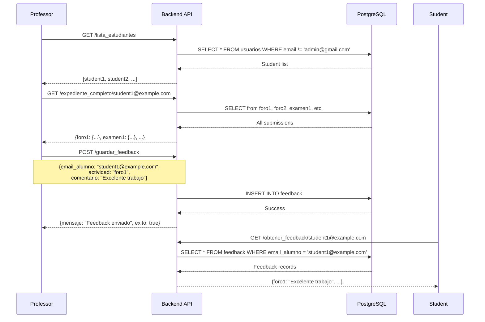

The feedback system enables professors to review student submissions and provide personalized comments on each activity, which students can then view in their profile.

## Overview

The feedback system creates a communication channel between professors and students:

<CardGroup cols={2}>
  <Card title="Professor View" icon="chalkboard-user">
    - Access complete student expedients
    - View all forum/exam submissions
    - Provide activity-specific feedback
    - Track student progress
  </Card>
  
  <Card title="Student View" icon="user-graduate">
    - View feedback on profile page
    - See comments per activity
    - Track professor responses
    - No reply capability (one-way)
  </Card>
</CardGroup>

## Feedback Data Model

```python
# main.py:81-84
class FeedbackData(BaseModel):
    email_alumno: str  # Student's email
    actividad: str     # Activity name (e.g., "foro1", "examen1")
    comentario: str    # Professor's feedback text
```

<Info>
The `feedback` table automatically adds a timestamp (`fecha`) when the record is created via PostgreSQL's `DEFAULT CURRENT_TIMESTAMP`.
</Info>

## How Feedback is Stored Per Activity

### Database Schema

The feedback table structure:

| Column | Type | Description |
|--------|------|-------------|
| `id` | SERIAL PRIMARY KEY | Auto-incrementing ID |
| `email_alumno` | VARCHAR | Student's email (foreign key to usuarios) |
| `actividad` | VARCHAR | Activity identifier ("foro1", "foro2", "examen1", etc.) |
| `comentario` | TEXT | Professor's feedback message |
| `fecha` | TIMESTAMP | Auto-generated timestamp |

### Activity Naming Convention

Feedback is organized by activity name:

- **Forums:** `"foro1"`, `"foro2"`, `"foro3"`, `"foro4"`, `"foro5"`, `"foro6"`
- **Exams:** `"examen1"`, `"examen2"`

<Note>
Each student can have multiple feedback entries (one per activity), but typically professors provide one feedback comment per activity per student.
</Note>

## Professor Workflow: Providing Feedback

### Step 1: Access Student Expedient

Professors view a complete student record:

```python
# main.py:411-472
@app.get("/expediente_completo/{email}")
async def expediente_completo(email: str):
    if email == "admin@gmail.com":
        return {
            "foro1": None, "foro2": None, "foro3": None,
            "foro4": None, "foro5": None, "foro6": None,
            "examen1": None, "examen2": None
        }
    
    conexion = conectar_bd()
    cursor = conexion.cursor(cursor_factory=RealDictCursor)
    
    # Fetch all forum submissions
    cursor.execute("SELECT * FROM respuestas_foro1 WHERE email = %s", (email,))
    foro1 = cursor.fetchone()
    
    cursor.execute("SELECT * FROM respuestas_foro2 WHERE email = %s", (email,))
    foro2 = cursor.fetchone()
    
    cursor.execute("SELECT * FROM respuestas_foro3 WHERE email = %s", (email,))
    foro3 = cursor.fetchone()
    
    cursor.execute("SELECT * FROM respuestas_foro4 WHERE email = %s", (email,))
    foro4 = cursor.fetchone()
    
    cursor.execute("SELECT * FROM respuestas_foro5 WHERE email = %s", (email,))
    foro5 = cursor.fetchone()
    
    cursor.execute("SELECT * FROM respuestas_foro6 WHERE email = %s", (email,))
    foro6 = cursor.fetchone()
    
    # Fetch exam submissions
    cursor.execute("SELECT * FROM examen1 WHERE email = %s", (email,))
    examen1 = cursor.fetchone()
    
    cursor.execute("SELECT * FROM examen2 WHERE email = %s", (email,))
    examen2 = cursor.fetchone()
    
    # Convert binary image data to base64 if present
    convertir_bytes(foro1)
    convertir_bytes(foro2)
    convertir_bytes(foro3)
    convertir_bytes(foro4)
    convertir_bytes(foro5)
    convertir_bytes(foro6)
    
    return {
        "foro1": foro1,
        "foro2": foro2,
        "foro3": foro3,
        "foro4": foro4,
        "foro5": foro5,
        "foro6": foro6,
        "examen1": examen1,
        "examen2": examen2
    }
```

<Accordion title="Image Data Conversion">
The `convertir_bytes()` function converts binary image data stored in PostgreSQL `BYTEA` columns to base64-encoded data URLs:

```python
# main.py:395-408
def convertir_bytes(registro):
    if not registro:
        return
    claves = list(registro.keys())
    for clave in claves:
        valor = registro[clave]
        if isinstance(valor, memoryview):
            valor = bytes(valor)
        if isinstance(valor, (bytes, bytearray)):
            encoded = base64.b64encode(valor).decode("utf-8")
            if 'imagen' in clave.lower():
                registro[clave] = f"data:image/jpeg;base64,{encoded}"
            else:
                registro[clave] = encoded
```

This is essential for Foro 5, which stores uploaded images.
</Accordion>

### Step 2: Submit Feedback

The professor submits feedback via the panel:

```python
# main.py:713-727
@app.post("/guardar_feedback")
async def guardar_feedback(datos: FeedbackData):
    conexion = conectar_bd()
    if not conexion: raise HTTPException(500, "Error BD")
    try:
        cursor = conexion.cursor()
        query = "INSERT INTO feedback (email_alumno, actividad, comentario) VALUES (%s, %s, %s)"
        cursor.execute(query, (datos.email_alumno, datos.actividad, datos.comentario))
        conexion.commit()
        return {"mensaje": "Feedback enviado", "exito": True}
    except Exception as e:
        print(e)
        return {"mensaje": str(e), "exito": False}
    finally:
        conexion.close()
```

**Example Request:**

```http
POST /guardar_feedback
Content-Type: application/json

{
  "email_alumno": "student@example.com",
  "actividad": "foro1",
  "comentario": "Excelente análisis de la DMO. Considera profundizar en los factores genéticos que mencionaste. Calificación: 9/10"
}
```

<Steps>
  <Step title="Professor Selects Student">
    From the student list at `/lista_estudiantes`
  </Step>
  
  <Step title="View Student Expedient">
    Loads `/expediente_completo/{email}` to see all submissions
  </Step>
  
  <Step title="Write Feedback">
    For each activity (foro1, examen1, etc.), professor can write comments
  </Step>
  
  <Step title="Submit Feedback">
    POST to `/guardar_feedback` with student email, activity name, and comment
  </Step>
</Steps>

## Student Workflow: Viewing Feedback

### Retrieving Feedback

Students fetch their feedback from the profile page:

```python
# main.py:729-742
@app.get("/obtener_feedback/{email}")
async def obtener_feedback(email: str):
    conexion = conectar_bd()
    if not conexion: raise HTTPException(500, "Error BD")
    try:
        cursor = conexion.cursor(cursor_factory=RealDictCursor)
        cursor.execute(
            "SELECT * FROM feedback WHERE email_alumno = %s ORDER BY fecha DESC", 
            (email,)
        )
        lista = cursor.fetchall()
        
        # Convert to dictionary keyed by activity name
        feedback_dict = {}
        for item in lista:
            feedback_dict[item['actividad']] = item['comentario']
        return feedback_dict
    finally:
        conexion.close()
```

**Example Response:**

```json
{
  "foro1": "Excelente análisis de la DMO. Considera profundizar en los factores genéticos. Calificación: 9/10",
  "foro2": "Buen trabajo con la tabla de datos. La interpretación es correcta.",
  "examen1": "Muy bien en las preguntas teóricas. El juego de parejas fue perfecto. Puntaje: 8/8"
}
```

<Info>
The endpoint returns a **dictionary** where keys are activity names and values are the most recent feedback comment for that activity. If a student has multiple feedback entries for one activity (unlikely), only the most recent is shown due to `ORDER BY fecha DESC` and dictionary key overwriting.
</Info>

### Frontend Display Example

```javascript
// Example usage in a Vue component
const feedback = ref({});

async function cargarFeedback() {
  const email = localStorage.getItem("usuario");
  const response = await fetch(`https://proyecto-ingenieria-software-6ccv.onrender.com/obtener_feedback/${email}`);
  feedback.value = await response.json();
}

// Display in template
```

```vue
<div v-if="feedback['foro1']" class="bg-blue-900/20 border border-blue-500/30 p-4 rounded-xl">
  <h4 class="font-bold text-blue-300 mb-2">Feedback - Foro 1</h4>
  <p class="text-white/90">{{ feedback['foro1'] }}</p>
</div>

<div v-if="feedback['examen1']" class="bg-green-900/20 border border-green-500/30 p-4 rounded-xl">
  <h4 class="font-bold text-green-300 mb-2">Feedback - Examen 1</h4>
  <p class="text-white/90">{{ feedback['examen1'] }}</p>
</div>
```

## Special Case: Student Expedient View

Students can view a **limited expedient** of their own work:

```python
# main.py:475-530
@app.get("/expediente_completo_alumno/{email}")
async def expediente_completo(email: str):
    if email == "admin@gmail.com":
        return {
            "foro1": None, "foro2": None, "foro3": None,
            "foro4": None, "foro5": None, "foro6": None,
            "examen1": None, "examen2": None
        }
    
    conexion = conectar_bd()
    cursor = conexion.cursor(cursor_factory=RealDictCursor)
    
    # Only fetch specific fields (e.g., r2 from each activity)
    cursor.execute("SELECT r2 FROM respuestas_foro1 WHERE email = %s", (email,))
    foro1 = cursor.fetchone()
    
    cursor.execute("SELECT r2 FROM respuestas_foro2 WHERE email = %s", (email,))
    foro2 = cursor.fetchone()
    
    cursor.execute("SELECT r2 FROM respuestas_foro4 WHERE email = %s", (email,))
    foro4 = cursor.fetchone()
    
    cursor.execute("SELECT r2 FROM respuestas_foro3 WHERE email = %s", (email,))
    foro3 = cursor.fetchone()
    
    cursor.execute("SELECT r5 FROM respuestas_foro5 WHERE email = %s", (email,))
    foro5 = cursor.fetchone()
    
    cursor.execute("SELECT r2 FROM examen1 WHERE email = %s", (email,))
    examen1 = cursor.fetchone()
    
    cursor.execute("SELECT r2 FROM examen2 WHERE email = %s", (email,))
    examen2 = cursor.fetchone()
    
    cursor.execute("SELECT r2 FROM respuestas_foro6 WHERE email = %s", (email,))
    foro6 = cursor.fetchone()
    
    return {
        "foro1": foro1,
        "foro2": foro2,
        "foro3": foro3,
        "foro4": foro4,
        "foro5": foro5,
        "foro6": foro6,
        "examen1": examen1,
        "examen2": examen2
    }
```

<Warning>
The student expedient endpoint (`/expediente_completo_alumno/{email}`) returns **only partial data** (specific response fields like `r2` or `r5`), whereas the professor expedient (`/expediente_completo/{email}`) returns **all fields**. This limits what students can see of their own submissions.
</Warning>

## Professor Panel: Student List

Professors access a list of all students:

```python
# main.py:374-388
@app.get("/lista_estudiantes")
async def lista_estudiantes():
    conexion = conectar_bd()
    if not conexion: raise HTTPException(500, "Error BD")
    try:
        cursor = conexion.cursor(cursor_factory=RealDictCursor)
        cursor.execute("""
            SELECT email, nombre, apellidos 
            FROM usuarios 
            WHERE email != 'admin@gmail.com'
            ORDER BY apellidos ASC
        """)
        return cursor.fetchall()
    finally:
        conexion.close()
```

**Response Example:**

```json
[
  {
    "email": "juan.perez@example.com",
    "nombre": "Juan",
    "apellidos": "Pérez"
  },
  {
    "email": "maria.garcia@example.com",
    "nombre": "María",
    "apellidos": "García"
  }
]
```

<Note>
The admin account is excluded from the student list via `WHERE email != 'admin@gmail.com'`.
</Note>

## Feedback Characteristics

### One-Way Communication

<CardGroup cols={2}>
  <Card title="Professor → Student" icon="arrow-right">
    ✅ Professors can write feedback
    
    ✅ Feedback is stored per activity
    
    ✅ Visible to student on profile
  </Card>
  
  <Card title="Student → Professor" icon="ban">
    ❌ Students cannot reply to feedback
    
    ❌ No notification system
    
    ❌ Students must check profile manually
  </Card>
</CardGroup>

### No Update/Edit Functionality

<Warning>
The current implementation does **not** support:
- Editing existing feedback (professors must insert new entries)
- Deleting feedback
- Marking feedback as "read" by students
- Email notifications when feedback is provided
</Warning>

## Complete API Reference

<CodeGroup>
```http POST /guardar_feedback
POST /guardar_feedback
Content-Type: application/json

{
  "email_alumno": "student@example.com",
  "actividad": "foro1",
  "comentario": "Muy buen análisis. Profundiza más en los factores genéticos. 9/10"
}

Response:
{
  "mensaje": "Feedback enviado",
  "exito": true
}
```

```http GET /obtener_feedback/{email}
GET /obtener_feedback/student@example.com

Response:
{
  "foro1": "Muy buen análisis. Profundiza más en los factores genéticos. 9/10",
  "foro2": "Excelente trabajo con la tabla de datos.",
  "examen1": "Perfecto. 8/8 puntos."
}
```

```http GET /expediente_completo/{email}
GET /expediente_completo/student@example.com

Response:
{
  "foro1": {
    "email": "student@example.com",
    "r1": "La DMO mide...",
    "r2": "Factores: ejercicio, dieta...",
    "r3": "...",
    "fecha": "2024-03-10T10:00:00Z"
  },
  "foro2": { ... },
  "foro3": { ... },
  "examen1": {
    "email": "student@example.com",
    "r1": "C) Son iguales en la niñez...",
    "r6": "8",
    "fecha": "2024-03-15T14:30:00Z"
  },
  "examen2": null
}
```

```http GET /expediente_completo_alumno/{email}
GET /expediente_completo_alumno/student@example.com

Response:
{
  "foro1": { "r2": "Factores: ejercicio, dieta..." },
  "foro2": { "r2": "..." },
  "foro3": { "r2": "..." },
  "foro4": { "r2": "..." },
  "foro5": { "r5": "..." },
  "foro6": { "r2": "..." },
  "examen1": { "r2": "D) Porque aumenta conforme..." },
  "examen2": { "r2": "En la vida adulta: ..." }
}
```

```http GET /lista_estudiantes
GET /lista_estudiantes

Response:
[
  {
    "email": "student1@example.com",
    "nombre": "Juan",
    "apellidos": "Pérez"
  },
  {
    "email": "student2@example.com",
    "nombre": "María",
    "apellidos": "García"
  }
]
```
</CodeGroup>

## Workflow Diagram



<Tip>
Professors can use the feedback system to provide grades, suggestions, and encouragement. Students benefit from personalized guidance on each activity they complete.
</Tip>

<Note>
For production deployment, consider adding:
- Email notifications when feedback is posted
- "Unread" badge for new feedback
- Ability to edit/update existing feedback
- Threaded discussions (two-way communication)
- Feedback templates for common comments
</Note>
