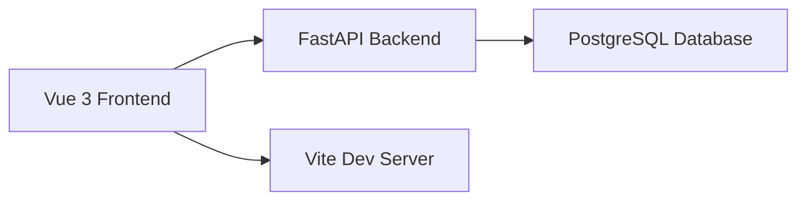

## What is the Calculus Learning Platform?

The Calculus Learning Platform is a comprehensive educational web application designed to help students understand the concept of **derivatives** through a contextualized, real-world scenario: analyzing the relationship between age and bone mineral density (BMD).

Rather than teaching derivatives in abstract terms, this platform immerses students in a practical medical scenario where they explore how bone density changes with age, naturally leading to concepts of rate of change and differentiation.

## Who is it for?

This platform serves two primary audiences:

<CardGroup cols={2}>
  <Card title="Students" icon="graduation-cap">
    Students learning calculus derivatives through interactive forums and activities that analyze bone density data across different age groups.
  </Card>
  <Card title="Professors" icon="chalkboard-user">
    Professors teaching differential calculus who need a structured didactic sequence with student progress tracking and feedback capabilities.
  </Card>
</CardGroup>

## Key Educational Concepts

The platform teaches derivatives through a contextual approach:

### Bone Mineral Density (BMD) Analysis

Students explore how bone mineral density varies with age by:

- **Investigating BMD basics** - Understanding what bone density is and how it's measured (mg/cm²)
- **Analyzing age relationships** - Examining whether BMD depends on age and vice versa
- **Studying evolution patterns** - Observing how BMD changes throughout a person's life
- **Exploring gender differences** - Investigating variations between male and female skeletal systems

### Learning Through Forums

The platform includes **6 interactive forums** where students:

1. **Forum 1** - Introduction to bone mineral density concepts
2. **Forum 2** - Analyzing BMD data and trends
3. **Forum 3** - Complex table-based BMD analysis
4. **Forum 4** - Advanced derivative applications
5. **Forum 5** - Visual analysis with image uploads
6. **Forum 6** - Synthesis and comprehensive understanding

Each forum allows students to submit responses, view peer contributions, and receive professor feedback.

<Info>
  The platform also includes **two exams** to assess student understanding of derivative concepts applied to the BMD context.
</Info>

## Technology Stack

The Calculus Learning Platform is built with modern web technologies:

### Frontend

- **Vue 3** - Progressive JavaScript framework for building the user interface
- **Vue Router 4** - Client-side routing for navigation between forums
- **Vite** - Fast build tool and development server
- **Tailwind CSS 4** - Utility-first CSS framework for styling
- **Axios** - HTTP client for API requests to the backend

### Backend

- **FastAPI** - Modern Python web framework for building the REST API
- **Uvicorn** - ASGI server for running the FastAPI application
- **PostgreSQL** - Relational database for storing user data and forum responses
- **Psycopg2** - PostgreSQL adapter for Python
- **Pydantic** - Data validation using Python type annotations

### Architecture

<Note>
  The application uses **CORS middleware** to enable communication between the frontend (running on Vite) and backend (running on Uvicorn).
</Note>

## Next Steps

Ready to get started?

<CardGroup cols={2}>
  <Card title="Quick Start" icon="rocket" href="/quickstart">
    Learn how to access and use the platform as a student
  </Card>
  <Card title="Installation" icon="code" href="/installation">
    Set up the development environment for contributing
  </Card>
</CardGroup>